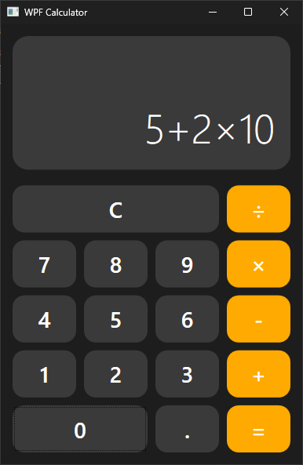
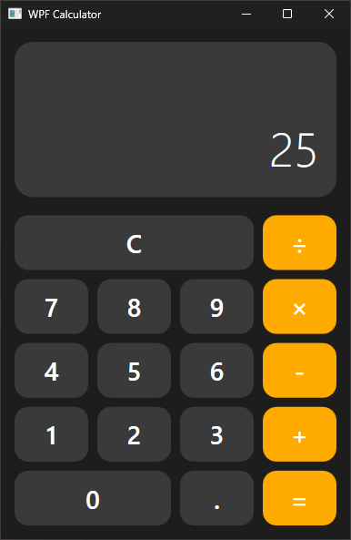
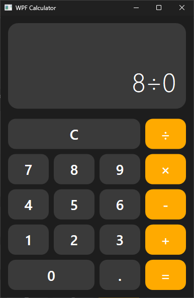
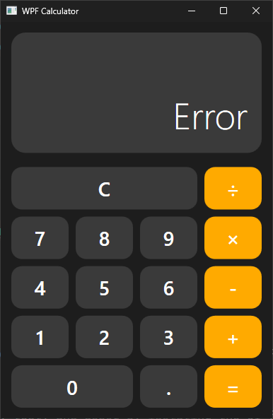

# 🧮 WPF Modern Calculator

A sleek, modern calculator built with C# and WPF, following the MVVM (Model-View-ViewModel) architectural pattern. It provides standard calculation functionalities with a focus on clean design and intuitive user experience.

---

## ©️ License & Authorship
**Author:** Arshan(N0Arxan)

**License:** This project is licensed under the MIT License.

---

## 📑 Table of Contents
- [⚙️ System Requirements](#-system-requirements)  
- [✨ Main Features](#-main-features)  
- [🚀 Installation Guide](#-installation-guide)  
- [📖 User Guide](#-user-guide)  
- [📸 Usage Examples & Screenshots](#-usage-examples--screenshots)  
- [💡 Conclusions](#-conclusions)  

---

## ⚙️ System Requirements
- **Operating System:** Windows 7 or later  
- **.NET Framework:** .NET 8.0 (or the version you compiled with)  
- **IDE (for development):** Visual Studio 2022  

---

## ✨ Main Features
- **Intuitive Interface:** A clean and modern UI with responsive buttons.  
- **Standard Operations:** Supports Addition (+), Subtraction (−), Multiplication (×), and Division (÷).  
- **Chained Operations:** Perform multiple calculations in a sequence (e.g., `10 * 2 − 5`).  
- **Operator Precedence:** Automatically handles the correct order of operations (multiplication/division before addition/subtraction).  
- **Error Handling:** Displays an “Error” message for invalid operations, like dividing by zero or malformed expressions.  
- **Reset Functionality:** A “C” button to clear the current state and start fresh.  
- **MVVM Architecture:** Clean separation of concerns between the UI (View), the application logic (ViewModel), and the data/business logic (Model).  

---

## 🚀 Installation Guide

1. **Clone the Repository:**  
   ```bash
   git clone https://github.com/your-username/WpfCalculator.git


2. **Open in Visual Studio:**

    * Navigate to the cloned directory.
    * Open `Calculator.sln` with Visual Studio 2022 or Rider.

3. **Build the Solution:**

    * In Visual Studio, go to **Build ➔ Build Solution** (or press `Ctrl+Shift+B`).

4. **Run the Application:**

    * Press the green **Start** button or press `F5` to run the project.

---

## 📖 User Guide

Using the calculator is straightforward:

1. **Inputting Numbers:**

    * Click the number buttons (`0–9`) to form an operand.

2. **Adding a Decimal:**

    * Use the `.` button to add a decimal point (only one decimal point per number is allowed).

3. **Performing Operations:**

    * Click an operator button (`+`, `−`, `×`, `÷`) to add it to the expression.
    * You can chain operations together (e.g., `5`, `×`, `5`, `+`, `10`).

4. **Calculating the Result:**

    * Press the `=` button to evaluate the entire expression. The result will be displayed.

5. **Clearing the Display:**

    * Press the `C` button at any time to reset the calculator to its initial state.

6. **Error States:**

    * If you enter an invalid expression (e.g., `8 ÷ 0`), the display will show **Error**.
    * Press `C` to continue.

---

## 📸 Usage Examples & Screenshots

Below are examples of how the calculator handles different scenarios. Replace the image paths with your actual screenshot filenames.


### Scenario 1: Chained Operation with Precedence

* **Input:** `5 + 2 × 10 =`
* **Result:** `25`

   




---

### Scenario 3: Error Handling

* **Input:** ` 8 / 0 =`
* **Result:** `Error`




---

## 💡 Conclusions

This project serves as a practical demonstration of the MVVM pattern in a WPF application. Key takeaways include:

* **Separation of Concerns:**
  MVVM makes the code easier to manage, test, and debug by isolating the UI from the logic. The View is “dumb,” the ViewModel handles state, and the Model performs the core work.

* **Data Binding:**
  WPF’s powerful data binding engine is the glue that connects the View and ViewModel, reducing the need for manual UI manipulation from the code-behind.

* **Styling and Reusability:**
  Using a `ResourceDictionary` for styles and colors keeps the UI definition clean and allows for consistent, reusable components.

This project can be extended with more advanced features such as memory functions (M+, M−, MR), scientific operations, and theming capabilities.

